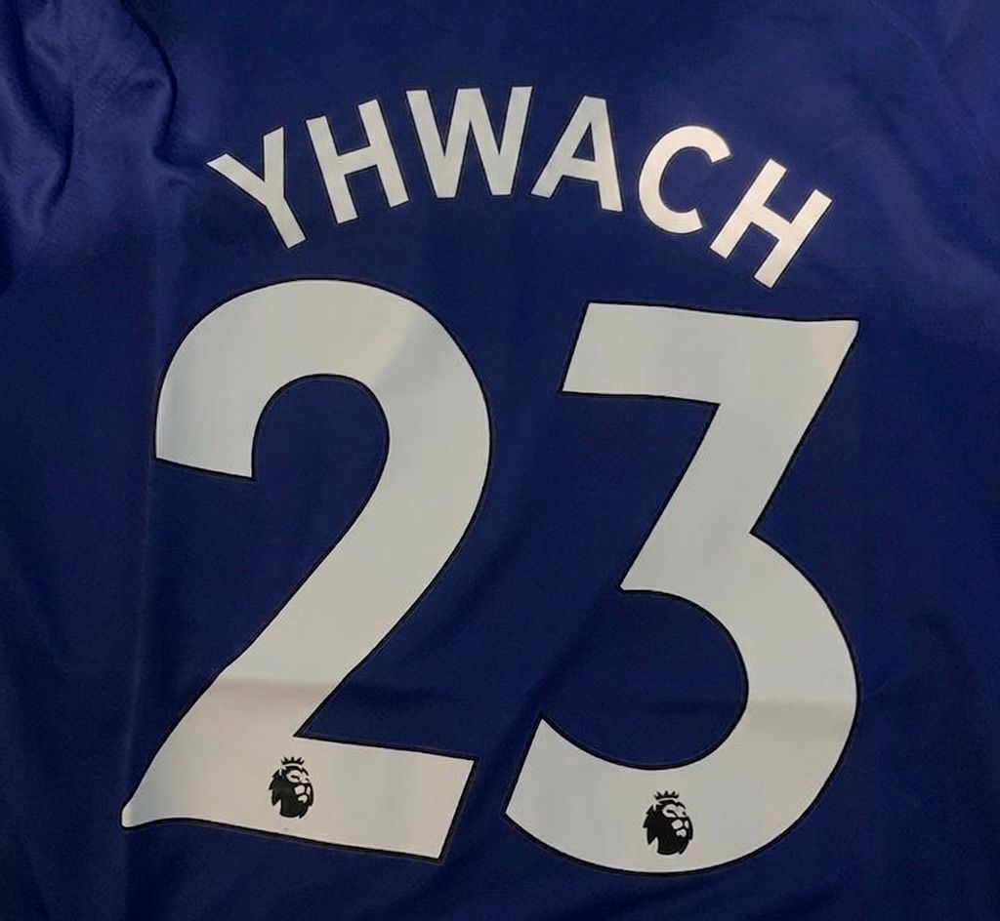

<picture>
  
</picture>

<div align="center">

# 👋 Yhwach

### "O código é o meu playground"

---

<details open>
<summary><b>⚡ Quem sou eu</b></summary>
<br>

```javascript
const yhwach = {
    nome: "Yhwach",
    foco: "HTML · CSS · JavaScript",
    objetivo: "Criar interfaces bonitas e funcionais",
    estudando: "Aprofundar no Front-End",
    curiosidade: "Deus do CSS 💀"
};
```

</details>

---

### 🛠️ Tecnologias

&nbsp;&nbsp;
&nbsp;&nbsp;


<br>


---

### 📊 Estatísticas


---

### 🔥 Sequência


---

### 🏆 Troféus


---

### 📈 Atividades


---

### 🐍 Cobrinha de Contribuições


*Essa cobrinha come seus commits! Quanto mais voce codar, maior ela fica.*

---

### 📫 Contato

[](https://github.com/GustavoGabrielFerreiraC)

<br>


---

⭐ **Obrigado pela visita!** ⭐

</div>
